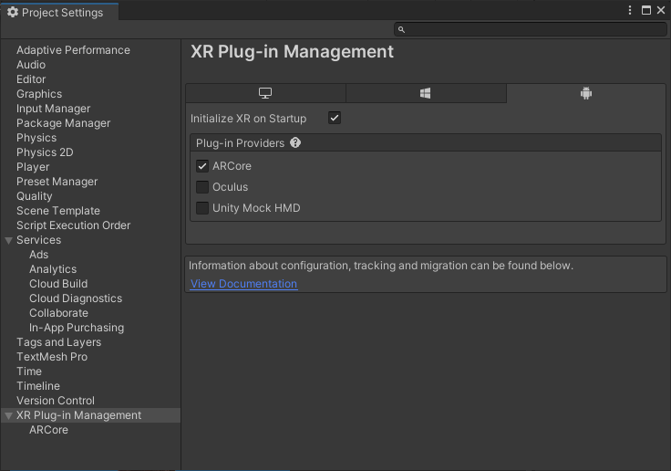
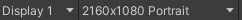

#  Nic-ARTeam - AR Education

This is the first version of the app. It is unstable and requires some performance fixes and code optimization.

## Unity Setup

Be sure to have this settings accordingly to the images below.

### For properly camera permissions and AR functionality:

### For properly canvas visualization:

You can set this regarding to your device resolution, but you will have to make changes to UI if it not applies correctly.

